<div align="center">

# 🛍️ ShopSphere

### Modern Electronics E-Commerce Platform

A responsive and modern e-commerce application built using **React**, **Vite**, **Firebase Authentication**, and **Context API**.

Designed to deliver a clean shopping experience with authentication, cart management, wishlist, checkout flow, dark mode, and responsive UI.

<br>


</div>

---

# 📖 About

ShopSphere is a modern electronics e-commerce application developed to simulate a real online shopping experience.

The application focuses on creating a responsive, clean and user-friendly interface while implementing features commonly found in production-level e-commerce platforms.

Users can browse products, search items, filter categories, manage their shopping cart, maintain a wishlist, authenticate securely, place orders and explore a modern shopping experience with both Light and Dark themes.

This project was developed to strengthen practical skills in **React, Context API, Firebase Authentication, Routing, State Management and Responsive UI Design.**

---

# ✨ Features

### 🛒 Shopping Experience

- Browse premium electronic products
- Product Details page
- Related Products
- Responsive Product Cards
- Product Search
- Category Filter
- Product Sorting
- Wishlist
- Shopping Cart
- Quantity Management
- Checkout Page
- Orders Page

---

### 🔐 Authentication

- Firebase Authentication
- User Registration
- Login
- Logout
- Protected Routes
- User Profile

---

### 🎨 User Interface

- Modern UI
- Responsive Design
- Dark Mode
- Light Mode
- Toast Notifications
- Sticky Navigation
- Smooth Scrolling
- Beautiful Animations

---

### 📄 Additional Pages

- About Us
- FAQs
- Shipping Policy
- Returns Policy

---

# 📂 Product Categories

| Category         | Products                               |
| ---------------- | -------------------------------------- |
| 📱 Electronics   | Smartphones, Tablets, TV, Refrigerator |
| 💻 Laptops       | MacBook, Gaming Laptops                |
| 🎧 Audio         | Headphones, Earbuds, Speakers          |
| 🎮 Gaming        | PS5, Xbox, Controller, Gaming Mouse    |
| ⌚ Smart Watches | Apple, Samsung, Fire-Boltt, Noise      |

---

# 🛠 Tech Stack

## Frontend

- React
- Vite
- JavaScript (ES6)
- CSS Modules

## State Management

- Context API

## Routing

- React Router DOM

## Authentication

- Firebase Authentication

## Notifications

- React Toastify

## Icons

- React Icons

---

# # 📸 Application Preview

## 🏠 Home

<p align="center">
  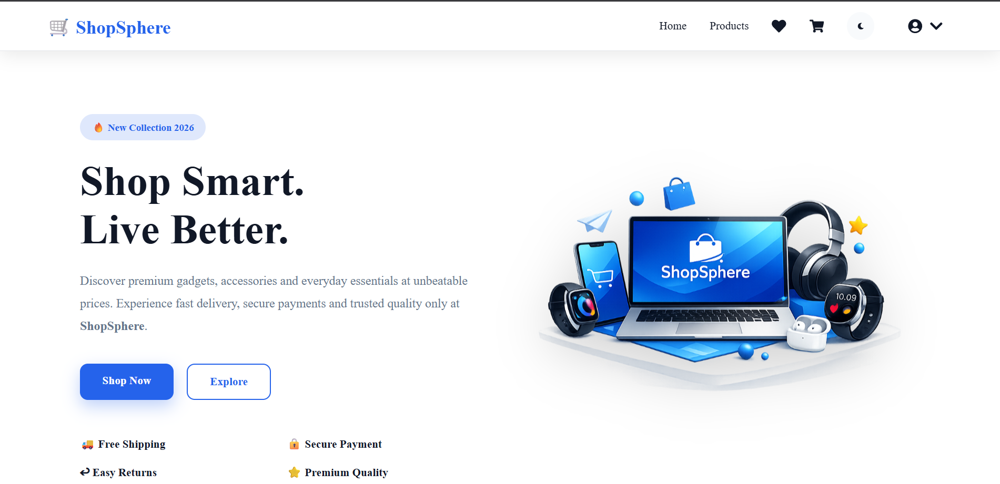
</p>

---

## 🛍️ Products & Product Details

<p align="center">
  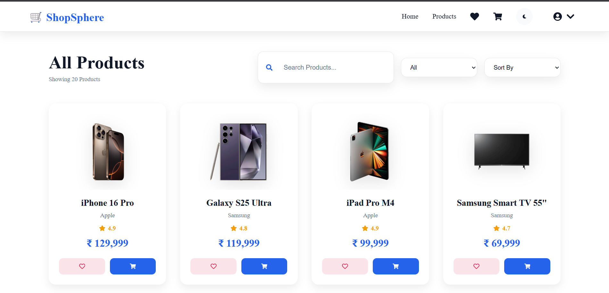
  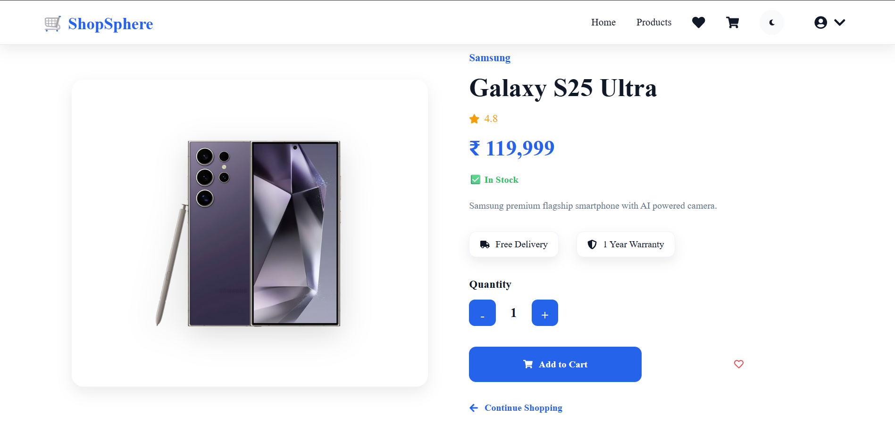
</p>

---

## ❤️ Wishlist & 🛒 Cart

<p align="center">
  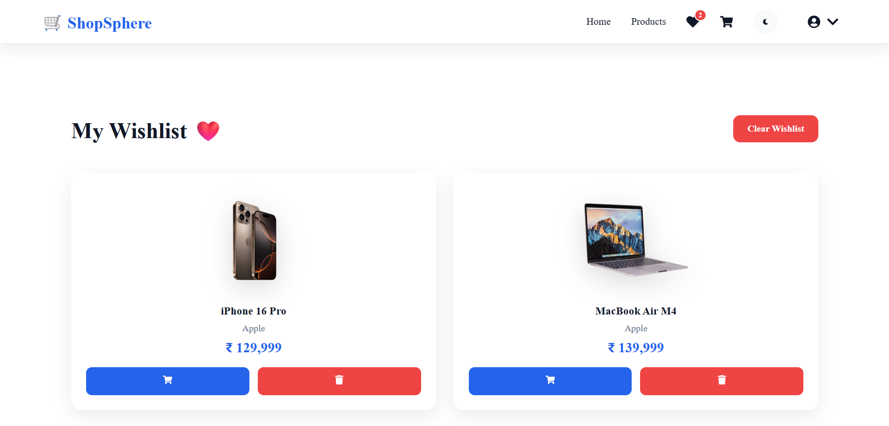
  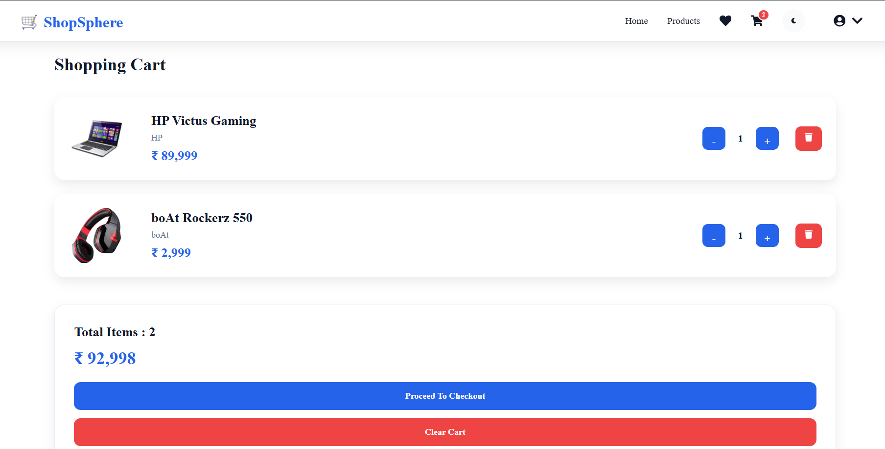
</p>

---

## 💳 Checkout & 👤 Profile

<p align="center">
  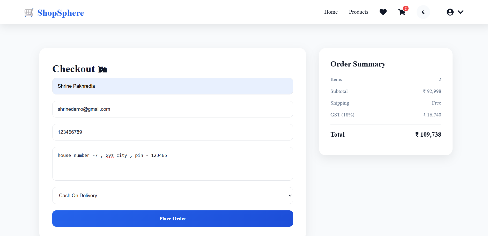
  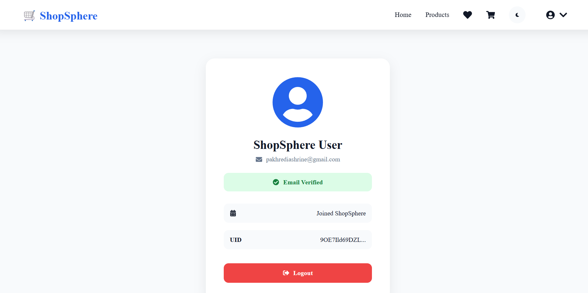
</p>

---

## 📦 Orders & ℹ️ About

<p align="center">
  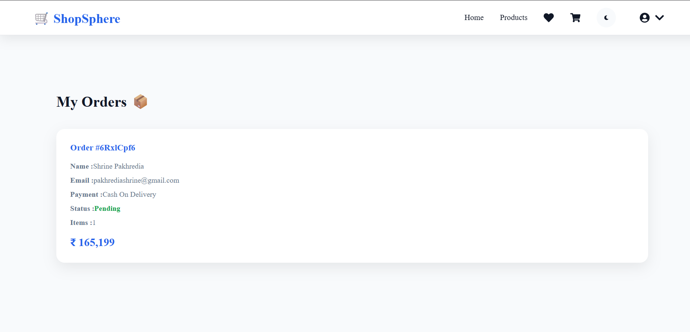
  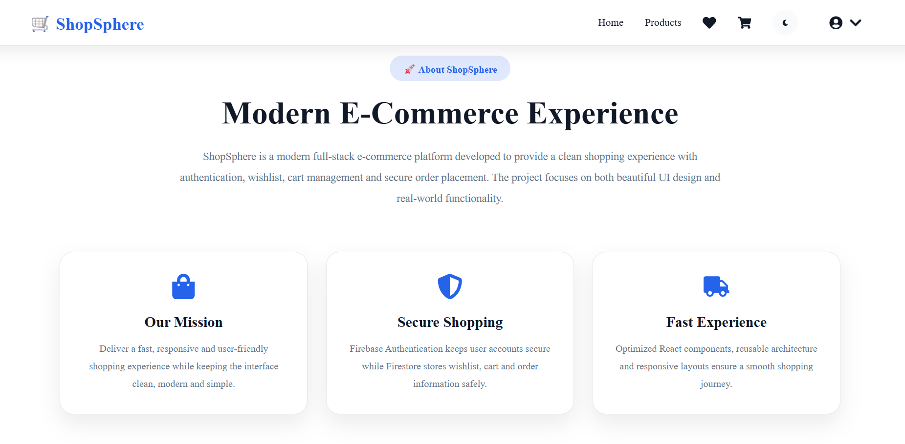
</p>

---

## ❓ FAQs, 🚚 Shipping & 🔄 Returns

<p align="center">
  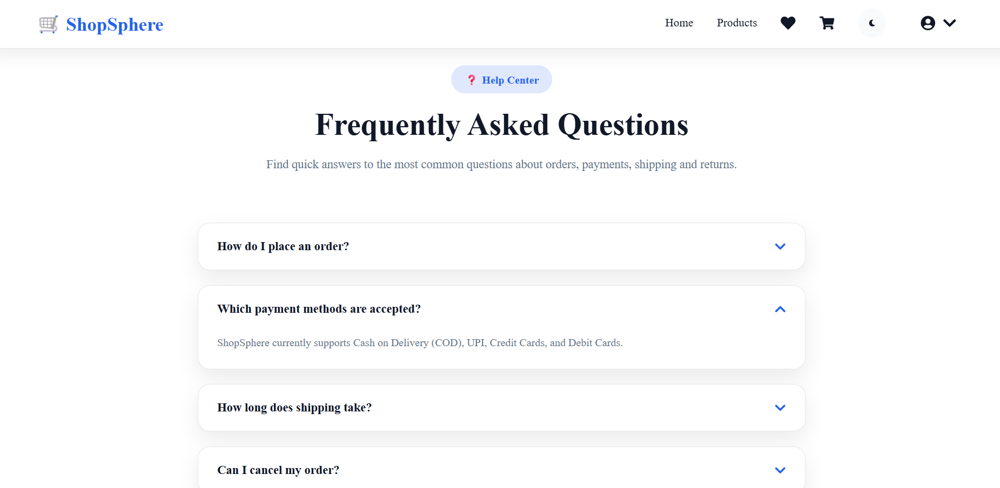
  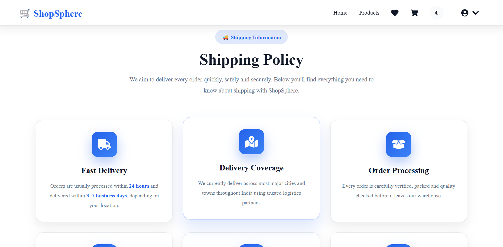
  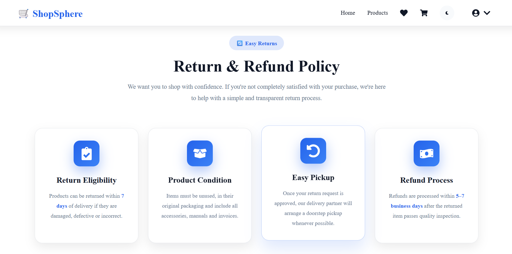
</p>

# 📂 Project Structure

```
ShopSphere
│
├── public
├── src
│   ├── assets
│   ├── components
│   ├── context
│   ├── data
│   ├── layout
│   ├── pages
│   ├── services
│   ├── style
│   ├── App.jsx
│   └── main.jsx
│
├── package.json
├── vite.config.js
└── README.md
```

---

# 🚀 Installation

Clone the repository

```bash
git clone https://github.com/shrinepakhredia-ui/ShopSphere.git
```

Move into the project directory

```bash
cd ShopSphere
```

Install dependencies

```bash
npm install
```

Run the development server

```bash
npm run dev
```

---

# ⚙️ Application Flow

The overall workflow of ShopSphere is designed to provide a seamless shopping experience.

```
User
   │
   ▼
Browse Products
   │
   ▼
Search / Filter / Sort
   │
   ▼
Product Details
   │
   ├──────────────┐
   ▼              ▼
Add to Cart   Add to Wishlist
   │              │
   ▼              ▼
Cart Page    Wishlist Page
   │
   ▼
Checkout
   │
   ▼
Orders
```

---

# 📌 Core Functionalities

### 🛍 Product Management

- Dynamic product listing
- Product search
- Category filtering
- Product sorting
- Product details page
- Related products section

---

### ❤️ Wishlist

- Add products to wishlist
- Remove products
- Protected Route support
- Persistent state using Context API

---

### 🛒 Shopping Cart

- Add products
- Remove products
- Increase quantity
- Decrease quantity
- Automatic total calculation
- Checkout integration

---

### 👤 User Authentication

- User Registration
- Secure Login
- Logout
- Profile Page
- Protected Routes

---

### 🌙 Theme Support

- Light Mode
- Dark Mode
- Theme switching
- Smooth transitions

---

### 📱 Responsive Design

Optimized for

- Desktop
- Laptop
- Tablet
- Mobile Devices

---

# 🎯 Learning Outcomes

This project helped strengthen practical understanding of:

- Component-Based Architecture
- React Hooks
- Context API
- State Management
- Client-side Routing
- Firebase Authentication
- Responsive Web Design
- Reusable Components
- Modern UI Development

---

# 🚀 Future Improvements

Some planned enhancements include:

- Payment Gateway Integration
- Product Reviews & Ratings
- Order Tracking
- Admin Dashboard
- Product Inventory Management
- AI-based Product Recommendation
- Coupon & Discount System
- Email Notifications
- Address Management
- Search Suggestions
- Product Comparison
- Recently Viewed Products

---

# 💻 Developer

## Shrine Pakhredia

**B.Tech – Artificial Intelligence & Machine Learning**

Interested in Artificial Intelligence, Machine Learning, and building projects that combine intelligent systems with practical applications.

# 🔗 Connect With Me

### GitHub

https://github.com/shrinepakhredia-ui

### LinkedIn

https://www.linkedin.com/in/shrine-pakhredia-57a75632a

---

# ⭐ If You Like This Project

If you found this project useful, consider giving it a ⭐ on GitHub.

It helps others discover the project and motivates future improvements.

---

# 📄 License

This project is intended for learning and educational purposes.

Feel free to fork, explore and customize it for your own practice.

---

<div align="center">

## 🛍️ ShopSphere

### Modern Electronics E-Commerce Platform

Built with using React, Vite and Firebase.

**Thanks for visiting this repository!**

⭐ Happy Coding ⭐

</div>
